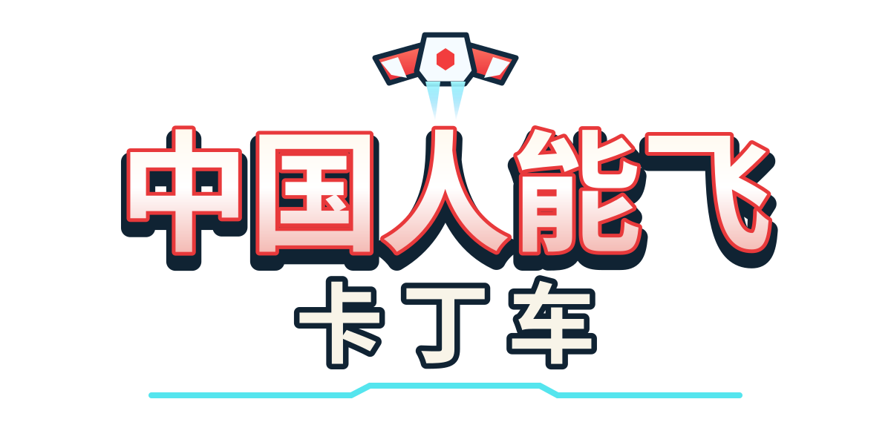

# 中国人能飞：卡丁车

开着低模卡丁车穿过樱花町，在弯道里漂移蓄力，拾取道具争夺冠军。拿到「中国人能飞」火箭后，推进器会出现在车后，让赛车腾空加速三秒；飞行中仍能转向，结束后回到赛道继续比赛。

**[在线游玩](https://cccircccle715.github.io/chinese-can-fly-kart/)** · [下载完整项目](https://github.com/CCCIRCCCLE715/chinese-can-fly-kart/releases/latest)



这是单人对战电脑的网页赛车游戏。一场比赛有八辆车，跑完三圈后按完赛顺序排名。公开版直接在浏览器中运行，支持键盘、触屏和游戏手柄；电脑运行本地服务后，还能把同一无线网络下的 iPhone 当作体感手柄。

## 赛车与赛道

第一辆可选赛车使用项目提供的 `108.blend` 导出模型，包括车身、驾驶员、轮胎和悬架部件。转向、车轮转动和车身反馈跟随游戏中的驾驶状态。其他可选赛车及七辆电脑对手保留各自原有外观。

樱花町赛道经过街景、住宅、公园、桥梁和隧道。小镇建筑与树木通过实例化绘制，远处樱花树使用简化显示；路面由碎石、泥土和铺装纹理混合构成。街巷和公园属于环境布景，比赛沿同一条闭合赛道进行。

游戏包含漂移蓄力与出弯加速、赛车选择、倒计时、圈数与排名、暂停和重赛，以及画质、声音和触屏操作设置。菜单、比赛和最后一圈分别使用连续循环音乐。

## 道具

赛道上的拾取物是悬浮自转的红白火箭，周围带光圈。玩家拾取后，道具暂时消失，约 2.5 秒后重新出现。当前道具池随机给出以下三种道具，电脑对手不能拾取或使用。

| 道具 | 每次拾取的使用次数 | 效果 |
| --- | --- | --- |
| 中国人能飞 | 1 次 | 车后挂载推进器，腾空加速三秒，空中可继续转向，随后落回赛道 |
| 香蕉 | 3 次 | 在后方留下香蕉，干扰经过的对手 |
| 尾气 | 3 次 | 向车后持续留下黄色尾气，命中的对手会打转并停顿 |

三种道具共用当前道具栏。拿到道具并等待图标准备完成后，按 **空格 / E** 或点击道具栏使用；手机手柄点击「道具」。道具飞行计时在暂停时停止，重赛会清除已有道具和飞行状态。

## 怎么玩

| 操作 | 键盘 |
| --- | --- |
| 加速 | W / ↑ |
| 转向 | A、D / ←、→ |
| 刹车或后退 | S / ↓ |
| 漂移 | Shift |
| 使用当前道具 | 空格 / E |
| 后视 | Q |
| 暂停 | Esc / P |

开始界面可选择赛车，并在「操作设置」中调整控制方式。触屏支持浮动摇杆、固定摇杆、方向按键和体感转向；横向握持设备游玩。游戏手柄使用摇杆转向，X 使用当前道具，其他操作提示随输入设备显示。

首次点击游戏页面后可开启声音。初次加载会下载场景、赛车、火箭和音乐；设备运行吃力时可在设置中降低画质。

## 在电脑上运行

需要 **Node.js 24 或更新版本**。首次安装依赖需要联网。完整本地服务还需要 **OpenSSL**，用于生成手机体感连接证书。

从仓库获取源码：

```sh
git clone https://github.com/CCCIRCCCLE715/chinese-can-fly-kart.git
cd chinese-can-fly-kart
npm ci
npm run build
npm start
```

也可下载版本页中的完整项目包，解压后在项目文件夹执行后面三条命令。完整包已附带 `dist/` 构建结果，但运行手机连接服务仍需安装 Node.js 和依赖。

在电脑浏览器打开 [本地游戏](http://127.0.0.1:18765/)。在运行 `npm start` 的终端按 Ctrl+C 停止服务。

macOS 可以双击 `启动赛车.command`：首次自动安装所需依赖并构建，之后打开浏览器。服务会在后台运行，日志保存在 `运行日志.txt`。解压后若不能执行，可运行 `chmod +x 启动赛车.command`。

## 用 iPhone 当手柄

体感手柄使用电脑上的本地转发服务。公开的 GitHub Pages 网页提供游戏本身，手机配对需按上一节在电脑运行完整项目。

1. 电脑与 iPhone 连接同一无线网络，在电脑游戏里点击「手机手柄」。
2. 首次使用，扫描「首次设置」二维码，用 Safari 下载本地证书描述文件。
3. 在「设置 → 通用 → VPN 与设备管理」中安装「中国人能飞：卡丁车 · 体感手柄」；在「设置 → 通用 → 关于本机 → 证书信任设置」中开启该证书的信任。
4. 扫描「打开手柄」二维码，手机横向握持，点击「启用体感」并允许访问运动与方向。
5. 拿稳手机完成中位校准后驾驶。左侧控制油门与后退，右侧使用道具与漂移；可调整转向幅度、反向转向和自动油门。

手机以转动角度控制方向，多个按键可以同时按住。离开页面、断线或输入超时会释放操作，恢复连接后重新接管驾驶。电脑上的主动暂停需要由玩家解除。

证书和私钥在当前电脑的 `.local/certs/` 生成，不随项目分发。换电脑或无线网络地址变化后，需要重新启动服务并扫描二维码。描述文件只安装本地连接证书，可在 iPhone 设置中移除。访客无线网络的设备隔离可能阻止电脑与手机互相连接。

## 开发与发布

```sh
npm run dev        # 游戏开发服务，默认端口 5173
npm run build      # 类型检查与正式网页构建
npm test           # 声音、输入、连接状态、场景和资源检查
npm run test:link   # 真实 HTTPS / WebSocket 配对与转发检查
```

手机配对使用完整本地服务：修改游戏源码后运行 `npm run build`，再用 `npm start` 启动。修改 `phone/` 下的手柄页面后刷新手机即可。

`dist/` 是静态网页发布目录，可部署到 HTTP / HTTPS 网站服务，支持站点根目录或仓库子目录。不能直接双击其中的 HTML 文件运行。

当前在线版由 GitHub Pages 的 `gh-pages` 分支发布。拥有仓库写入权限并配置 GitHub 登录后，运行：

```sh
node tools/publish-pages.mjs
```

脚本会重新构建并更新网页分支，优先使用 `publish` 远程，未配置时使用 `origin`。修改源码还需另行提交和推送 `main` 分支。CI 检查配置保存在 `docs/ci/check.yml.example`，作为配置示例。

发布版提供两个压缩包：**Complete** 包含源码、素材、启动脚本、手机服务及构建结果；**Web** 包含可部署的静态网页。包内不含已安装的依赖、本机证书、私钥、配对信息、缓存或渲染视频。

## 项目目录

| 路径 | 内容 |
| --- | --- |
| `src/game/` | 比赛、电脑对手、道具、尾气与飞行推进逻辑 |
| `src/kart/` | 车辆物理、转向、悬架反馈和导入赛车适配 |
| `src/world/` | 赛道、小镇、住宅、公园与樱花显示 |
| `src/core/`、`src/ui/` | 键盘、手柄、触屏、录屏、菜单与比赛 HUD |
| `phone/`、`runtime/` | iPhone 体感手柄、证书生成、配对与输入转发 |
| `public/assets/` | 赛车、火箭、街景模型和路面纹理 |
| `public/images/`、`public/audio/` | 项目标题和循环音乐 |
| `tests/`、`tools/` | 自动检查、资源生成、浏览器验证和发布工具 |
| `docs/` | 系统说明、设计参考和素材记录 |

本地服务可通过 `KART_LAN_IP`、`KART_CERT_DIR`、`KART_PORT`、`KART_TLS_PORT` 设置无线网络地址、证书目录、电脑页面端口和手机 HTTPS 端口。默认端口分别为 18765 与 18766。系统分工见 [系统设计](docs/系统设计.md)，制作资料见 [设计资料](docs/design/README.md)。

## 来源与许可

本项目在 [Ryan Campbell / Kart Royale](https://github.com/ryancampbell/kart-royale) 的赛车框架上开发，原始参考提交为 `036c0efb025f5ecf8fc31c405e9d818c61e03e21`。本项目接入了提供的卡丁车与火箭资产，增加中文界面、樱花町场景、短时飞行道具、尾气、本地 iPhone 体感手柄及相关运行工具。源码沿用 [MIT 许可证](LICENSE)，保留原作者版权声明。

赛车与火箭由项目提供的三维资产导出。素材中的品牌名称和标识用于模型表现，不表示品牌方合作或背书。场景、树木和路面纹理分别保留各自来源与许可：

- [小镇与樱花资产说明](public/assets/japanese-town/README.md)
- [路面纹理说明](public/assets/road-surfaces/README.md)
- [Kenney 赛车场景许可](public/maps/kenney/LICENSE-Starter-Kit-Racing.txt)
- [Three.js 许可](public/maps/kenney/LICENSE-Three.txt)

依赖和素材的许可范围以对应文件为准。
