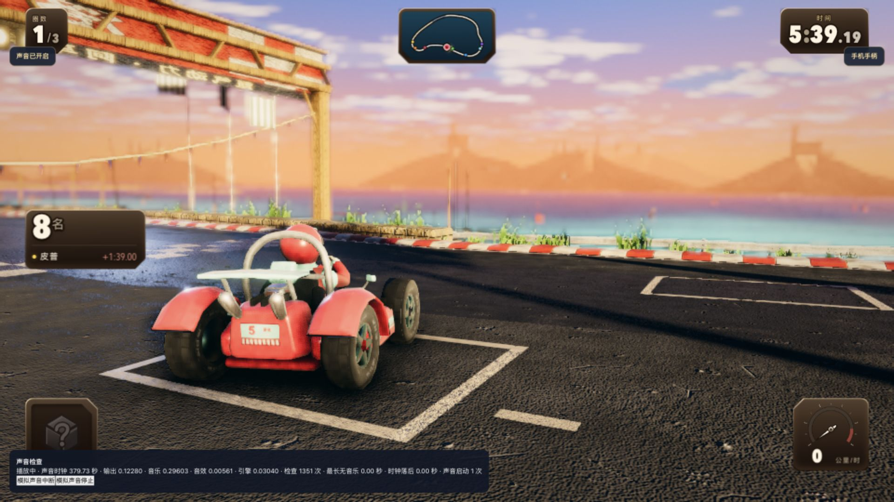
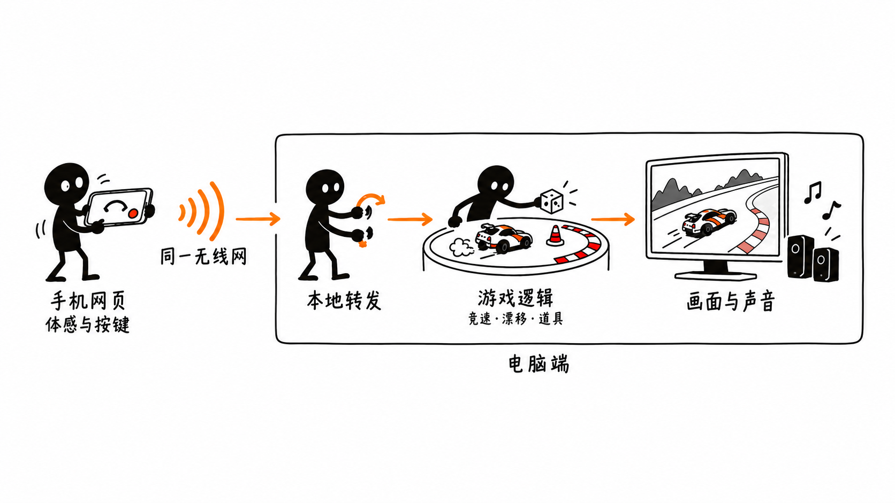

# 卡丁王者

中文浏览器卡丁车赛车，支持用同一无线网络下的 iPhone 做体感手柄。基于 [Ryan Campbell 的 Kart Royale](https://github.com/ryancampbell/kart-royale) 修改，保留原项目 MIT 许可证和署名。

[在线游玩](https://cccircccle715.github.io/kart-royale-cn/) · [完整项目下载](https://github.com/CCCIRCCCLE715/kart-royale-cn/releases/latest)

公开版无需安装，在现代浏览器中打开即可游玩，支持键盘、触屏和游戏手柄。iPhone 体感手柄需要电脑运行下文的本地服务，GitHub Pages 不提供配对转发服务。首次加载会下载赛车、火箭、场景与音乐；性能较弱的设备可在设置中降低画质。



## 已完成

- 中文菜单、比赛提示、手机手柄和图片标题。
- 卡丁车竞速、电脑对手、漂移加速、道具、画质设置和键盘操作。
- iPhone 横屏体感转向，校准中位、转向幅度和方向反转。
- 手机左侧油门与后退，右侧道具和漂移；支持多指同时操作。
- 自动油门；连接且启用体感后自动接管驾驶。首次运动授权需要在手机上点击允许。
- 配对、输入过期保护、断线释放操作、重新连接和恢复驾驶。
- 菜单、比赛、最后一圈的连续循环音乐；音效与引擎声独立处理，声音中断后恢复。

第一辆可选赛车已接入 `108.blend` 导出的卡丁车模型，其余可选赛车和电脑对手保留原有外观。赛道使用樱花町街景、住宅与公园，模型和纹理随项目分发。

悬浮火箭是赛道拾取物，拾取后暂时消失并重新出现。当前道具池包含香蕉、尾气与「中国人能飞」火箭；只有玩家能拾取和使用。香蕉和尾气每次拾取可用三次，火箭可用一次，提供三秒飞行推进并允许转向。使用当前道具可按空格或 E，也可点击道具栏。WASD / 方向键驾驶，Shift 漂移，Esc 暂停。

## 启动

电脑需安装 **Node.js 24 或更新版本**及 **OpenSSL**。macOS 通常已有 OpenSSL；其他系统需要自行安装并放入可执行程序搜索路径。首次安装需要联网，安装完成后游戏本身可在本地运行。电脑与手机连接同一个无线网络，需允许本地服务通过防火墙；访客网络的设备隔离可能阻止连接。

下载整个仓库并解压，在项目文件夹执行：

```sh
npm ci
npm run build
npm start
```

在电脑浏览器打开 **http://127.0.0.1:18765/**，首次点击游戏界面后开启声音。运行 `npm start` 的窗口按 Ctrl+C 可停止服务。

macOS 也可以双击 `启动赛车.command`。首次会自动安装、构建并打开浏览器；这个方式让服务在后台运行，日志写入 `运行日志.txt`。源码压缩包解压后若文件不可执行，可先运行 `chmod +x 启动赛车.command`。想方便地停止服务，请使用上面的 `npm start` 方式。

GitHub 版本附件中的完整压缩包已经附带构建好的游戏，仍需要安装 Node.js 和依赖；首次双击启动时会自动安装依赖。

## 连接 iPhone

1. 在电脑游戏里点击「手机手柄」。
2. 首次使用，扫描安装证书的二维码，用 Safari 打开。下载「赛车体感手柄」描述文件。
3. 手机打开「设置 → 通用 → VPN 与设备管理」，安装该描述文件；再去「设置 → 通用 → 关于本机 → 证书信任设置」开启该证书的完全信任。
4. 扫描电脑上的「打开手柄」二维码，横向握持手机，点击「启用体感」并允许访问运动与方向。
5. 拿稳手机完成中位校准，连接后即可驾驶。油门和后退在左侧，道具和漂移在右侧；也可开启自动油门。

证书只用于这份本地游戏的加密连接，不包含设备管理、代理或网络修改。证书与私钥保存在本机 `.local/certs/`，不随仓库分发。换一台电脑需要使用那台电脑生成的证书。无线网络地址变化时重启服务并重新扫描二维码；本地证书机构有效期为一年，服务器证书为 90 天、接近到期时会重新生成。用完可以移除手机描述文件。

## 项目结构与系统设计



手机网页读取体感与按键，通过加密连接发送到电脑上的本地转发服务；电脑游戏负责赛车逻辑、绘制画面和播放声音。手机不需要计算赛车画面，也不需要安装专门的手柄应用。

| 目录 | 内容 |
| --- | --- |
| `src/` | 画面、赛道、车辆、电脑对手、道具、声音和手机输入接管 |
| `phone/` | 横屏手机手柄、体感与多指按键 |
| `runtime/` | 启动、本地证书生成、配对与转发 |
| `public/` | 赛车、火箭、场景模型、路面纹理、标题和循环音乐 |
| `tools/` | 音乐离线生成、自动检查运行器 |
| `tests/` | 声音恢复、连续播放、体感、输入和连接检查 |
| `docs/` | 设计图、比赛画面和本次修改说明 |

详细实现见 [系统设计说明](docs/系统设计.md)。

## 开发和检查

```sh
npm run dev        # 修改电脑游戏，默认端口 5173
npm test           # 声音、体感、输入、场景、资源和车辆边界检查
npm run test:link  # 真实加密配对与转发检查，自动创建临时证书和测试服务
npm run build      # 检查并生成游戏
```

`npm run dev` 用于电脑游戏开发。手机配对需要完整本地服务，请构建后用 `npm start` 打开 18765 端口。修改源码后应重新构建；手机网页由服务直接读取，修改后刷新手机即可。

打开 `http://127.0.0.1:18765/?soundcheck=1` 可显示声音检查面板。普通游戏不显示该面板。完整循环音乐的生成步骤见 [连续音乐生成说明](tools/连续音乐生成说明.md)。

可通过环境变量设置：`KART_LAN_IP` 为电脑的无线网络地址，`KART_CERT_DIR` 为证书目录，`KART_PORT` 为游戏端口，`KART_TLS_PORT` 为手机加密连接端口。默认分别为自动检测地址、`.local/certs/`、18765、18766。端口被另一个副本占用时，应先停止旧服务或为两个端口选择其他值。

## 网页发布

`npm run build` 生成可部署的 `dist/`，资源路径支持站点根目录和 GitHub Pages 仓库子目录。将其中的文件部署到静态网站服务即可；需要 HTTP / HTTPS 服务，不支持直接双击 HTML 文件运行。

本仓库通过 `gh-pages` 分支发布在线版。更新源码后，执行 `node tools/publish-pages.mjs` 重新构建并上传；需要已登录 GitHub、对本仓库有写权限，并将发布远程配置为 `publish`。发布脚本不会上传本地证书或配对信息。

## 来源与许可

原始项目：**Ryan Campbell / Kart Royale**，基于下载时的提交 `036c0efb025f5ecf8fc31c405e9d818c61e03e21`。本仓库包含中文界面、iPhone 手柄、本地运行器、导入车辆与道具、樱花町场景和声音连续播放等修改；源码遵循 [MIT 许可证](LICENSE)。依赖的软件包保留各自许可证。

设计图中的车型名称及品牌用于创意参考，非官方合作或授权声明。设计资料是本项目的生成参考图，不属于原项目素材。赛车与火箭模型由项目提供的三维资产导出；品牌标识及名称不表示品牌方参与或背书。场景资产的来源与许可证见 [场景说明](public/assets/japanese-town/README.md)、[路面纹理说明](public/assets/road-surfaces/README.md) 和 `public/maps/kenney/` 中的许可文件。

本仓库包含运行所需源码与资源，不包含本机连接二维码、真实配对信息、证书私钥、缓存、安装好的依赖或私人文件。构建结果由本地构建产生，完整版本附件另外附带构建结果。
